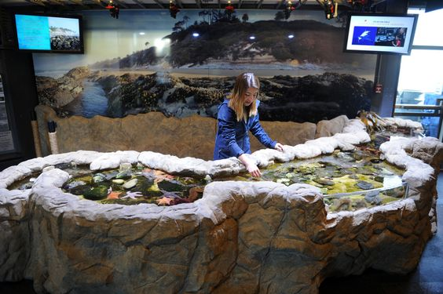
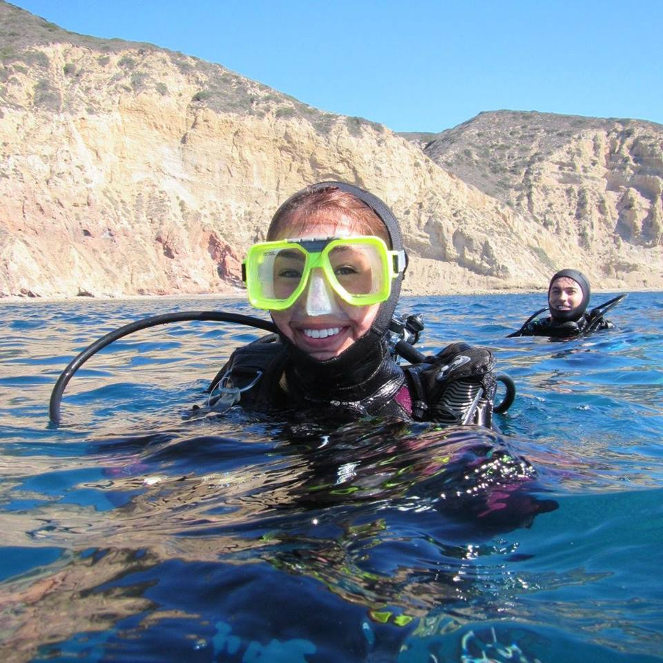
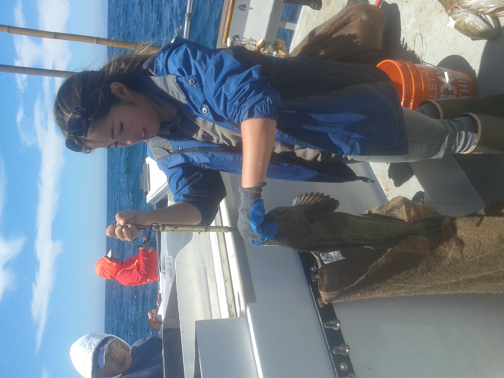
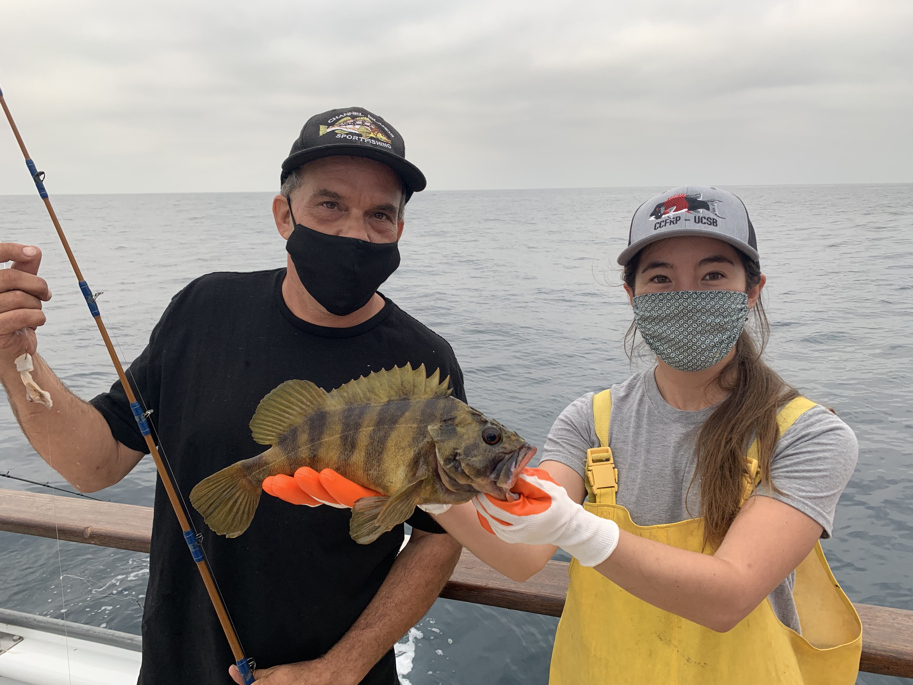
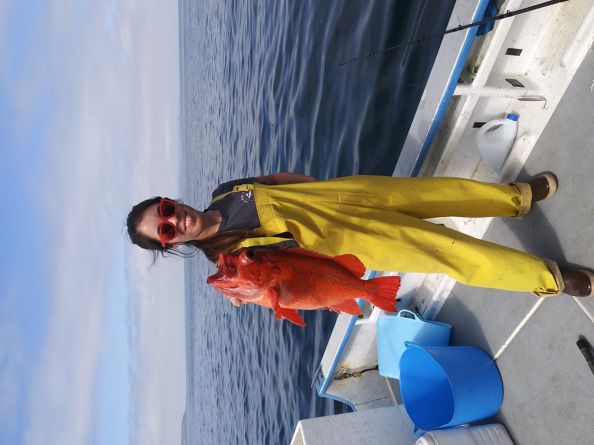

```{r setup, include=FALSE}
knitr::opts_chunk$set(echo = FALSE)
```

## Experience 



While completing my undergraduate education at University of California, Santa Barbara (UCSB), I spent a good portion of my time taking the bus from campus to State Street and then paying a quarter to ride the electric shuttle to Stearns Wharf. The amount of time spent on public transit was balanced by shifts volunteering as an exhibit interpreter and assistant aquarist at the Santa Barbara Museum of Natural History Sea Center. It was a priceless introduction to the local Santa Barbara Channel marine wildlife and taught me much about species identification, life history, and the importance of educating the public about environmental issues. 



Not fully satisfied only getting my hands wet, I completed the AAUS Scientific Diving course which opened the door to a whole new level of ocean-related experiences. I got Open Water certified at 12 (which provided my most awkward cert card photo to date) and have since gone on to become divemaster, rescue diver, and full face mask certified.  


I was able to leverage the Scientific Diver certification into a job as a research diver in Milton Love's lab upon graduating in 2015. As much as I enjoyed my time sorting ichthyoplankton samples and entering data, it was wonderful to become a part of the data collection process. With a B.A in Environmental Science, and a B.S in Aquatic Science completed, my first personal research project focused on the ability to identify giant sea bass (*Stereolepis gigas*) from their spot patterns. The project has grown, and in collaboration with the Benioff Ocean Initiative, we created [Spotting Giant Sea Bass](https://spottinggiantseabass.msi.ucsb.edu/). The project allows community scientists to submit images of giant sea bass that are then identified based on pattern matching algorithms. This photographic mark-recapture work allows us to learn more about the distribution and life history of this previously over-fishes species. Current work with giant sea bass focuses around using baited remote underwater video to observe seasonal movements around Anacapa Island. 


### To All the Fish I Loved Before...I'm Sorry

The best way I can describe my research focus would have to be "I like fish." I have been incredibly grateful that much of my work since graduation centers around this phrase. 



While working for California Department of Fish and Wildlife as a scientific aide I was able to collect fishery- dependent data for the California Recreational Fisheries Survey (CRFS). 2 years measuring catch aboard vessels at sea, from private boaters at the dock, and from pier and surf anglers was informative. Speaking with anglers daily to educate them about conservation of the resource was fufilling. 

A few other fish- adjacent projects I have had the pleasure to assist with: 

- California Collaborative Fisheries Research Program (CCFRP)

- Collection and processing of specimens for sequencing DNA of *Sebastes* fishes , .jpg)





